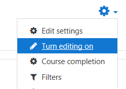
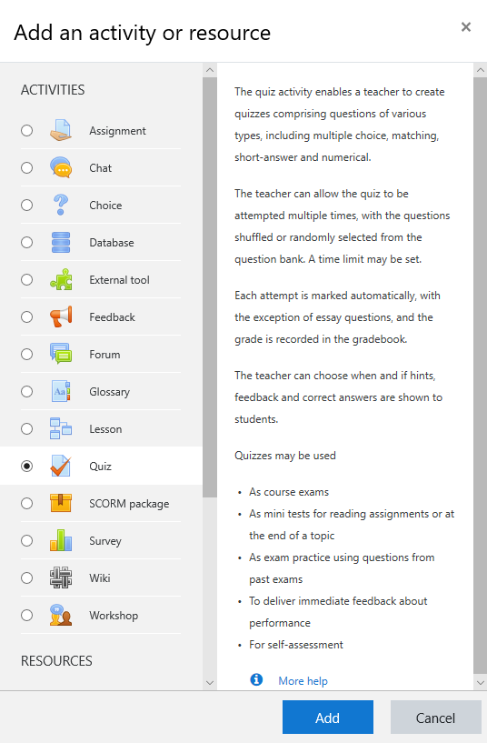
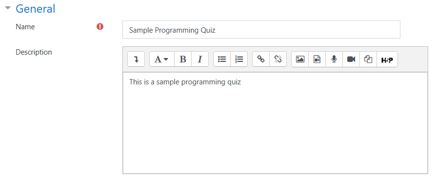
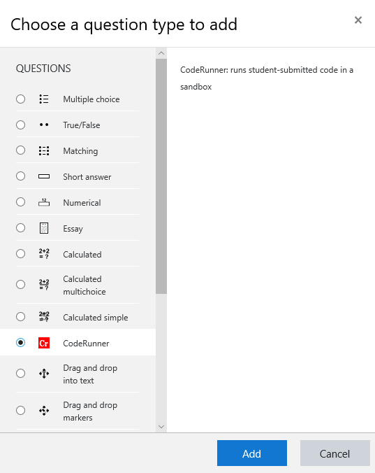
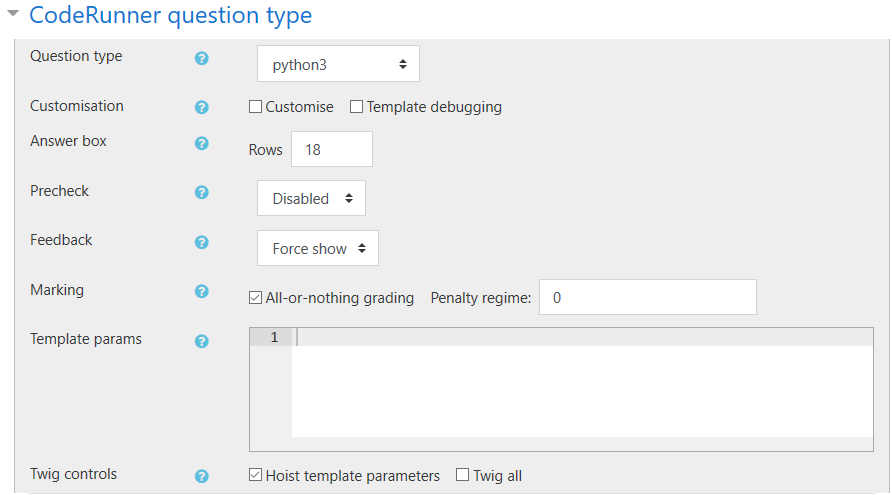
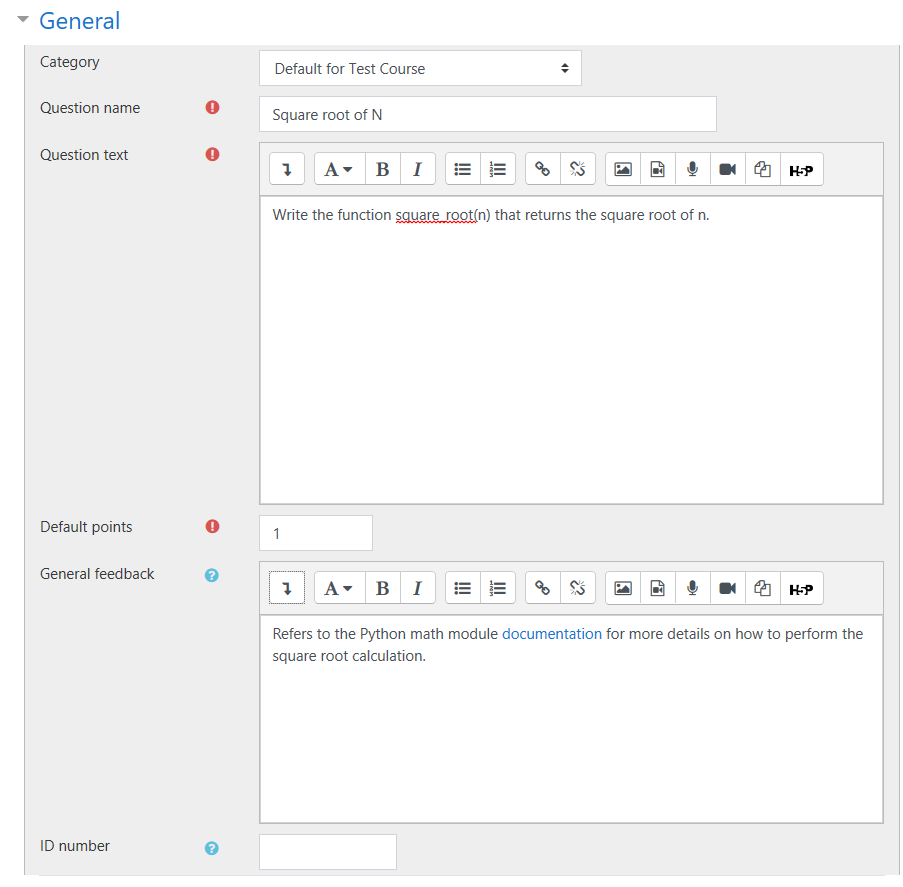
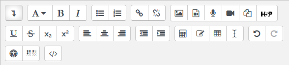
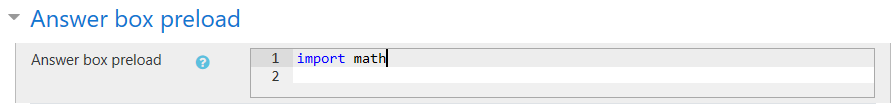

# Step-by-Step Quick Start Guide for Moodle CodeRunner

## Step 1: Enable edit mode for your course
Click the cog icon at the top right of the course page and choose `Turn editing on`.  


## Step 2: Add a new quiz
Click on `Add an activity or resource` under the desired section.

Select `Quiz` in the list and the click `Add`.  


Add a name and a description for your quiz, scroll down to the bottom, and then click `Save and display`. You may also edit the other options for your quiz as usual.  


## Step 3: Add a programming question
Click `Edit quiz`.

Click on the `Add` dropdown menu, then choose `a new question`.

Under the `Choose a question type` window, select `CodeRunner` and then click `Add`.  


## Step 4: Edit your programming question
> **Tip:** Click on the blue `?` icon to learn more about each option.

### Question type
Under the `CodeRunner question type` section, select the `Question type` (e.g. `python3`).  


#### Marking
Under marking, choose if you want `All-or-nothing grading`. And define the `Penalty regime`. More details about what these two items mean can be read by clicking on the blue `?` icon.

### General
Under the `General` section, fill out the details for your programming question.


> **Tip:** Use the editing tools the make editing your question easier.
> 
> 

### Answer
Under the `Answer` section, fill in the answer to the programming question. Do not forget to import the module you use (e.g. `import math`).

> **Tip:** Keep the `Validate on save` option checked to have the system check your answer key against the test cases that you have defined further down on this page when you save the programming question.

### Answer box preload
Under `Answer box preload`, you can enter the text that will be preloaded into the answer box. You can use this option to, for example, provide the import statements for your students so that the can focus on just writing the answer. You can also use this feature to provide hints.



**Example:**
```Python
import math

def square_root(n):
    # Fill in your code
```
