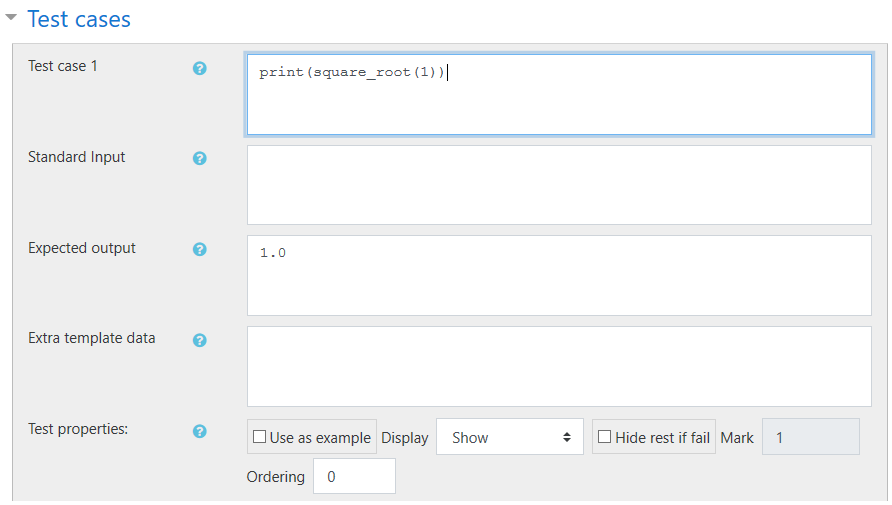
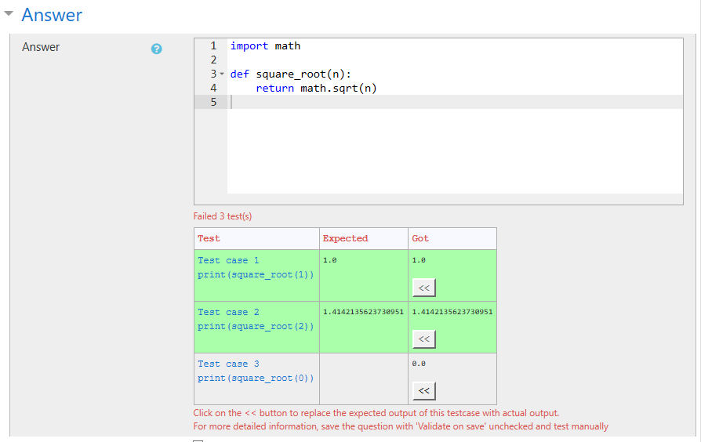

# Step-by-Step Quick Start Guide for Moodle CodeRunner

## Step 1: Enable edit mode for your course
Click the cog icon at the top right of the course page and choose `Turn editing on`.  

## Step 2: Add a new quiz
Click on `Add an activity or resource` under the desired section.

Select `Quiz` in the list and the click `Add`.  

Add a name and a description for your quiz, scroll down to the bottom, and then click `Save and display`. You may also edit the other options for your quiz as usual.  

## Step 3: Add a programming question
Click `Edit quiz`.

Click on the `Add` dropdown menu, then choose `a new question`.

Under the `Choose a question type` window, select `CodeRunner` and then click `Add`.  

## Step 4: Edit your programming question
> **Tip:** Click on the blue `?` icon to learn more about each option.

### CodeRunner question type
Under the `CodeRunner question type` section, select the `Question type` (e.g. `python3`).  

#### Marking
Under marking, choose if you want `All-or-nothing grading`. And define the `Penalty regime`. More details about what these two items mean can be read by clicking on the blue `?` icon.

### General
Under the `General` section, fill out the details for your programming question.

> **Tip:** Use the editing tools the make editing your question easier.  
> 

### Answer
Under the `Answer` section, fill in the answer to the programming question. Do not forget to import the module you use (e.g. `import math`).

> **Tip:** Keep the `Validate on save` option checked to have the system check your answer key against the test cases that you have defined further down on this page when you save the programming question.

### Answer box preload
Under `Answer box preload`, you can enter the text that will be preloaded into the answer box. You can use this option to, for example, provide the import statements for your students so that the can focus on just writing the answer. You can also use this feature to provide hints.  

### Test cases
Under the `Test cases` section, you can define test cases for your programming question. Ideally you should define at least 4-5 test cases for each programming question. And your test cases should cover the edge cases as well.  

#### Defining a test case
In each test case, fill in the code of the test in the first box (`Test case n`, where `n` is the number of the test case). If the code to be tested reads data from standard input, fill the data for the code in the `Standard Input` box, otherwise you can leave it blank. Next fill the output you expected from your test case in the `Expected output` box.

Click on `Blanks for 3 more choices` to add blanks for more test cases.

#### Test properties
- `Use as example`: If checked, your students will see this test case as an example case when they open this programming problem.
- `Display`: 
    - `Show`: Always show this test case and its result to the student after every attempt submitted.
    - `Hide`: Students will never see this test case, but this test case will still be used to grade the programming question.
    - `Hide if fail`: Hide this test case only if the student failed it.
    - `Hide if succeed`: Hide this test case only if the student have successfully solved it.
- `Hide rest if fail`: Tick this checkbox to hide the rest of the test cases from the student he/she they fails the programming question.
- `Mark`: Amount of marks that will be granted to the student if they passed this test case. This option is available only when `All-or-nothing grading` is not checked under the `CodeRunner question type` > `Marking` section.
- `Ordering`: CodeRunner will show the list of test cases to the student ordered by the `Ordering` number (lowest order at the top of the list).

## Step 5: Save the programming question
Scroll to the bottom of the page and click `Save changes`, or `Save changes and continue editing` if you want to continue editing the programming question.

> **Tip:** If you have enabled `Validate on save`, you can verify and quickly fill `Expected output` of the test cases with the actual output from your `Answer` code by scrolling to the `Answer` section after saving and click on the `<<` button on of each test case. Be sure to test your `Answer` code manually thoroughly before doing this, otherwise you might end up with wrong `Expected output`s.  
> 
